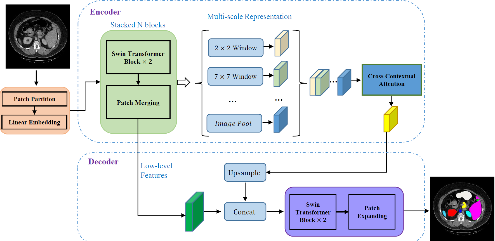
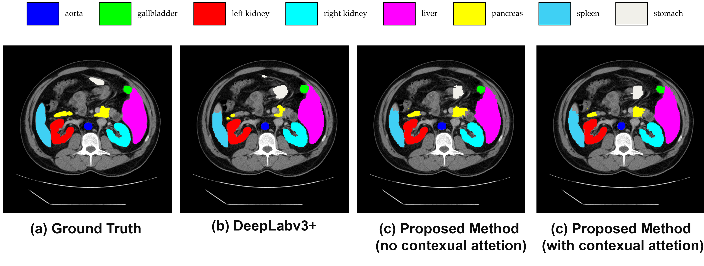
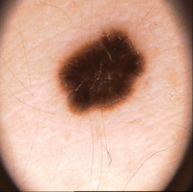
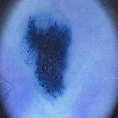

# TransDeepLab

The official code for "_TransDeepLab: Convolution-Free Transformer-based DeepLab v3+ for Medical Image Segmentation_".



---

## Updates
- July 20, 2022: Initial release.
- July 4, 2022: Submitted to MICCAI PRIME2022 [Under Review].
---

## Setting up and Training

- We use the code base from the [Swin-Unet GitHub repo](https://github.com/HuCaoFighting/Swin-Unet) as our starting point.

- In order to run the code and experiments, you need to first install the dependencies and then download and move the data to the right place. 
    -  For the _Synapse_ dataset, we used the data provided by [TransUnet](https://github.com/Beckschen/TransUNet)'s authors.
    - For _ISIC 2017-18_ datasets, we used the ISIC Challenge datasets [link](https://challenge.isic-archive.com/data/).
    - For the _PH<sup>2</sup>_ dataset, we used this [link](https://www.dropbox.com/s/k88qukc20ljnbuo/PH2Dataset.rar).

- We have put the required instructions for doing the above steps in the `./setup.sh` file in the repo for your convenience. `cd` to this repo directory and then run it to install dependencies and download and move data to the right dir.

- Download Swin-T pre-trained weights from this [link](https://drive.google.com/file/d/1_5ImUyETWGRH0sCYu5HzHgqHCeo-69mz/view?usp=sharing) and put it into the folder `pretrained_ckpt/`.

- Then you need to run the `train.py` file with the appropriate arguments to run your experiment. let's just see an example for now for the _Synapse_ dataset:

```bash
python train.py --config_file 'swin_224_7_{# of SSPP}level' --dataset Synapse --root_path './data' --max_epochs 200 --output_dir '.'  --img_size 224 --base_lr 0.05 --batch_size 24
```
---

## Config files and hyperparameters

- All the hyperparameters related to building different models are in separate files in `./model/configs` directory.

- For each experiment, you need to make your desired `config_name.py` file and put it in the `model/configs` dir and then enter the file name (without `.py` suffix) in the `python train.py` command you saw in the previous section after `--config_file` arg.

- For the rest of the hyperparameters like `batch_size`, `max_epochs`, `base_lr`, ... look at the `Swin-Unet` or the code here to see what you can change and how to do so.

---
## Test
- The model can be tested with the following command using `test.py` file. During training, model checkpoints will be saved to disk with the following format: `output_dir/{config_file_name}_epoch_{epoch_num}.pth`.

- It takes the checkpoint (model weight file) name as an input argument and loads the appropriate config file from the configs dir.

- Other arguments and flags can be given to the `test.py` file if some settings need to be modified but `--ckpt_path` and `--config_file` are the only required arguments.

- Trained weights for our best-reported results in the paper for the _Synapse_ dataset are easily accessible from [this link](https://drive.google.com/drive/folders/17AYvKNYIHYvbhkOEE8VRO5vbADNYQEVG?usp=sharing), where you could download it as a sole folder via [gdown](https://github.com/wkentaro/gdown) or setting specific links listed under the below table:

| Model setting name | Pre-trained weights | `--config_file` name|
| --- | --- | --- |
|SSPP Level 1 | [link](https://drive.google.com/file/d/1gjYUEi3fw90IgenmlLzms2qx8f_-WXJe/view?usp=sharing)| `swin_224_7_1level` |
| SSPP Level 2 | [link](https://drive.google.com/file/d/1UuZrFcZNRMAc6c_xiNMK471n1d1r4ows/view?usp=sharing) | `swin_224_7_2level` |
| SSPP Level 3 | [link](https://drive.google.com/file/d/111KqDd0SVKKJtLnQlTDaJi03WO9CsZew/view?usp=sharing) | `swin_224_7_3level` |
| SSPP Level 4 | [link](https://drive.google.com/file/d/1015liUD9gz6sygtvMH6oGb0oHqODFsoW/view?usp=sharing) | `swin_224_7_4level` |
- :exclamation: Remember to put these weights in a specific folder that you are going to address them with `test.py` via `--ckpt_path` flag.

- Comparison results table on the _Synapse_ dataset:

| <h3 align="left">**Methods** </h3> | DSC <p>&#8593;</p> | HD <p> &#8595;</p>  | Aorta | Gallbladder | Kidney(L) | Kidney(R) | Liver | Pancreas | Spleen | Stomach |
| --- |:---:|:---:|:---:|:---:|:---:|:---:|:---:|:---:|:---:|:---:|
| **V-Net** |  68.81 |  -  |  75.34 |  51.87 |  77.10 | **80.75**  |  87.84  |  40.05 | 80.56 |  56.98 |
| **R50 U-Net** |  74.68  |  36.87  |  87.74 |  63.66 |  80.60 |  78.19 |  93.74 | 56.90 |  85.87 | 74.16 |
| **U-Net** |  76.85 |  39.70 |  89.07 |  **69.72** |  77.77 |  68.60 |  93.43 |  53.98 |  86.67 | 75.58 |
| **R50 Att-UNet** |  75.57 |  36.97 |  55.92 | 63.91 | 79.20 | 72.71 | 93.56 | 49.37 | 87.19 | 74.95 |
| **Att-UNet** |  77.77 |  36.02 | **89.55**  | 68.88 | 77.98 | 71.11 | 93.57 | 58.04 | 87.30 | 75.75 |
| **R50 ViT** |  71.29 |  32.87 |  73.73 |  55.13 |  75.80 |  72.20 |  91.51 |  45.99 |  81.99 | 73.95 |
| **TransUnet** |  77.48 |  31.69 |  87.23 |  63.13 |  81.87 |  77.02 |  94.08 |  55.86 |  85.08 |  75.62 |
| **SwinUnet** |  79.13 |  21.55 |  85.47 |  66.53 |  83.28 |  79.61 | **94.29** | 56.58 | **90.66** | 76.60 |
| **DeepLabv3+ (CNN)** | 77.63 | 39.95 | 88.04 | 66.51 | 82.76 | 74.21 | 91.23 | 58.32 | 87.43 | 73.53 |
| **TransDeepLab** | **80.16** | **21.25** | 86.04 | 69.16 | **84.08** | 79.88 | 93.53  |**61.19** | 89.00 |  **78.40**|

- Impact of modifying modules inside the proposed method:

|<h3 align="left">**Setting**</h3>| DSC <p>&#8593;</p> | HD <p> &#8595;</p> | Aorta | Gallbladder | Kidney(L) | Kidney(R)| Liver | Pancreas| Spleen | Stomach |
| --- |---:|:---:|:-------:|:---:|:---:|:---:|:---:|:---:|:---:|:---:|
| **CNN as Encoder**| 75.89 | 28.87 | 85.03 | 65.17 | 80.18 | 76.38| 90.49 | 57.29  | 85.68 | 69.93 |
| **Basic Scale Fusion**| 79.16 | 22.14| 85.44 | 68.05 | 82.77| 80.79 | 93.80 | 58.74  | 87.78 | 75.96 |
| **SSPP Level 1** | 79.01 | 26.63  | 85.61 | 68.47  | 82.43 | 78.02  | 94.19 | 58.52 | 88.34 | 76.46 |
| **SSPP Level 2** | 80.16 | 21.25 | 86.04 | 69.16 | 84.08 | 79.88 | 93.53 | 61.19 | 89.00 | 78.40 |
| **SSPP Level 3** | 79.87 | 18.93 | 86.34 | 66.41 | 84.13 | 82.40 | 93.73 | 59.28 | 89.66 | 76.99 |
| **SSPP Level 4** | 79.85  | 25.69 | 85.64 | 69.36 | 82.93  | 81.25 | 93.09 | 63.18 | 87.80 | 75.56 |


- A look at the number of parameters:

| Model | # Encoder Parameters | # ASPP Parameters | # Decoder Parameters | # Total |
| --- | ----------- | --- | --- | --- |
| Original DeepLab (Xception-512) | 37.86 | 15.53 | 1.30  | 54.70 |
| Original Swin-Unet (224-7) | - | - | - | 27.17 |
| Our TransDeepLab (swin_224_7_1level) | 12.15 | 1.83 | 3.49 | 17.48 |
| Our TransDeepLab (swin_224_7_2level) | 12.15 | 5.49 | 3.49 | 21.14 |
| Our TransDeepLab (swin_224_7_3level) | 12.15 | 9.20 | 3.49 | 24.85 |
| Our TransDeepLab (swin_224_7_4level) | 12.15 | 12.96 | 3.49 | 28.61 |

---
## Visualization
- Results on the _Synapse_ dataset:


| Image | Ground Truth | Prediction |
| --- | --- | --- | 
|  | | |
|  | | |
---
## References
- [TransUNet](https://github.com/Beckschen/TransUNet)
- [Swin-Unet](https://github.com/HuCaoFighting/Swin-Unet)
---
## Citation
```

```
